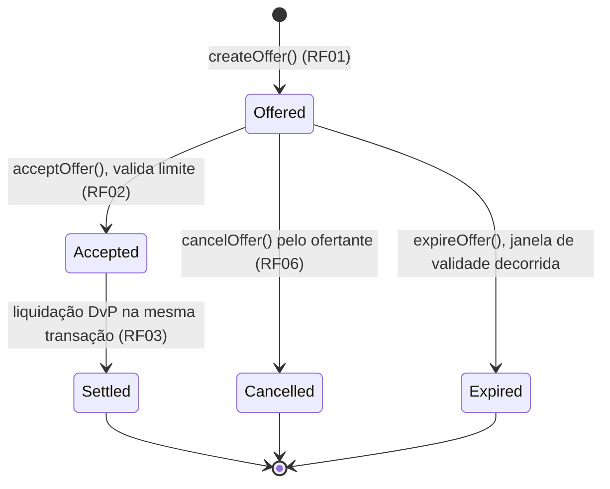

# Máquina de Estados — Oferta de Crédito Interfinanceiro (CDI)

> Entregável: Semana 1 (14/09–20/09) · Web3
> Referência: TAP Banco Inter — RF01, RF02, RF03, RF06

## Estados

| Estado | Enum | Descrição |
| --- | --- | --- |
| **Ofertada** | `Offered` | Instituição registrou oferta de crédito overnight (taxa CDI, valor e prazo). |
| **Aceita** | `Accepted` | Contraparte aceitou a oferta e o limite foi validado. É um estado transitório. |
| **Liquidada** | `Settled` | A liquidação atômica DvP foi concluída. Estado final. |
| **Cancelada** | `Cancelled` | Oferta cancelada pelo ofertante antes do aceite. Estado final. |
| **Expirada** | `Expired` | Janela de validade da oferta (`expiresAt`) decorrida sem aceite. Estado final. |

`Accepted` e `Settled` ocorrem na mesma transação: primeiro emite-se o aceite,
depois a liquidação. Se a liquidação falhar, toda a transação reverte e a
oferta permanece `Offered`.

`expiresAt` é independente do `term` do empréstimo: `term` é o prazo do
crédito overnight concedido após o aceite, enquanto `expiresAt` é o prazo de
validade da própria oferta (definido por `validityWindow` em `createOffer`,
contado a partir de `createdAt`). Contratos não têm execução agendada, então
a transição `Offered → Expired` é observada de duas formas:
- **leitura (lazy)**: `getOfferStatus` retorna `Expired` assim que
  `block.timestamp >= expiresAt`, mesmo que ninguém tenha chamado
  `expireOffer` ainda; `getOffer` continua retornando o último status
  persistido.
- **persistência (explícita)**: qualquer conta pode chamar `expireOffer`
  após o vencimento para gravar `Expired` on-chain e emitir `OfferExpired`.

`acceptOffer` e `cancelOffer` sempre fazem a checagem lazy antes de agir —
uma oferta vencida não pode ser aceita nem cancelada, mesmo que `expireOffer`
ainda não tenha sido chamado.

## Diagrama

## Gatilhos e guardas

| Transição | Função | Guarda | Efeito | Evento |
| --- | --- | --- | --- | --- |
| `[*] → Offered` | `createOffer` | valor, prazo e janela de validade maiores que zero | Cria a oferta com `expiresAt` | `OfferCreated` |
| `Offered → Accepted` | `acceptOffer` | oferta existe, está ofertada, não expirou e há limite | Marca aceite transitório | `OfferAccepted` |
| `Accepted → Settled` | continuação de `acceptOffer` | DvP concluído | Liquida atomicamente | `OfferSettled` |
| `Offered → Cancelled` | `cancelOffer` | ofertante, oferta ainda ofertada e não expirou | Cancela | `OfferCancelled` |
| `Offered → Expired` | `expireOffer` | oferta existe, está ofertada e `block.timestamp >= expiresAt` | Persiste vencimento (chamável por qualquer conta) | `OfferExpired` |

## Invariantes

- Uma oferta pode ser aceita apenas uma vez.
- `cancelOffer` é permitido somente em `Offered` e antes de `expiresAt`.
- `acceptOffer` também é bloqueado após `expiresAt`, mesmo que `expireOffer` não tenha sido chamado ainda.
- Falha de limite faz `acceptOffer` reverter por inteiro; não há estado persistido de rejeição.
- `Settled`, `Cancelled` e `Expired` são estados finais imutáveis.
