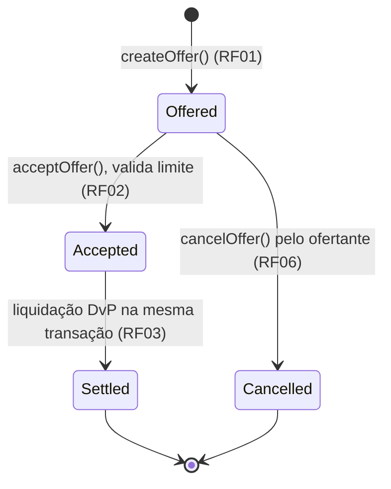

# Máquina de Estados — Oferta de Crédito Interfinanceiro (CDI)

> Entregável: Semana 1 (14/09–20/09) · Web3
> Referência: TAP Banco Inter — RF01, RF02, RF03, RF06

## Estados

| Estado | Enum | Descrição |
| --- | --- | --- |
| **Ofertada** | `Offered` | Instituição registrou oferta de crédito overnight (taxa CDI, valor e prazo). |
| **Aceita** | `Accepted` | Contraparte aceitou a oferta e o limite foi validado. É um estado transitório. |
| **Liquidada** | `Settled` | A liquidação atômica DvP foi concluída. Estado final. |
| **Cancelada** | `Cancelled` | Oferta cancelada pelo ofertante antes do aceite. Estado final. |

`Accepted` e `Settled` ocorrem na mesma transação: primeiro emite-se o aceite,
depois a liquidação. Se a liquidação falhar, toda a transação reverte e a
oferta permanece `Offered`.

## Diagrama

## Gatilhos e guardas

| Transição | Função | Guarda | Efeito | Evento |
| --- | --- | --- | --- | --- |
| `[*] → Offered` | `createOffer` | valor e prazo maiores que zero | Cria a oferta | `OfferCreated` |
| `Offered → Accepted` | `acceptOffer` | oferta existe, está ofertada e há limite | Marca aceite transitório | `OfferAccepted` |
| `Accepted → Settled` | continuação de `acceptOffer` | DvP concluído | Liquida atomicamente | `OfferSettled` |
| `Offered → Cancelled` | `cancelOffer` | ofertante e oferta ainda ofertada | Cancela | `OfferCancelled` |

## Invariantes

- Uma oferta pode ser aceita apenas uma vez.
- `cancelOffer` é permitido somente em `Offered`.
- Falha de limite faz `acceptOffer` reverter por inteiro; não há estado persistido de rejeição.
- `Settled` e `Cancelled` são estados finais imutáveis.
