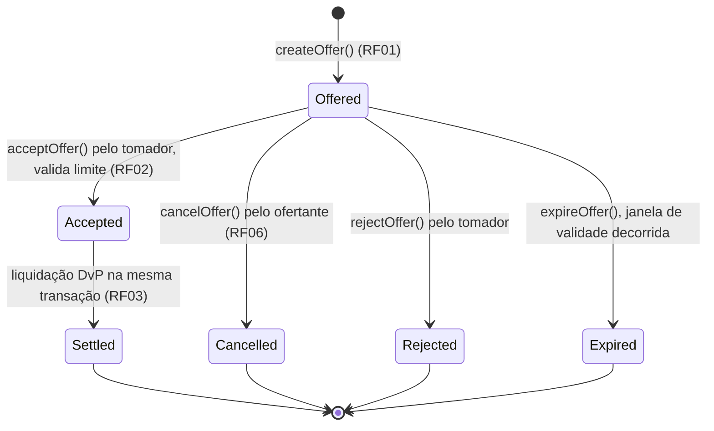

# Máquina de Estados — Oferta de Crédito Interfinanceiro (CDI)

> Entregáveis: Semana 1 (14/09–20/09) e Semana 2 · Web3
> Referência: TAP Banco Inter — RF01, RF02, RF03, RF06
> Implementação: `src/CreditInterbankOffer.sol` · Interface: `src/interfaces/ICreditInterbankOffer.sol`

## Estados

| Estado | Enum | Valor | Descrição |
| --- | --- | --- | --- |
| **Ofertada** | `Offered` | 0 | Instituição registrou oferta de crédito overnight direcionada a um tomador (taxa CDI, valor e prazo). |
| **Aceita** | `Accepted` | 1 | Tomador aceitou a oferta e o limite foi validado. Estado transitório: não é gravado on-chain, apenas sinalizado pelo evento `OfferAccepted`. |
| **Liquidada** | `Settled` | 2 | A liquidação atômica DvP foi concluída. Estado final. |
| **Cancelada** | `Cancelled` | 3 | Oferta retirada pelo ofertante antes do aceite. Estado final. |
| **Expirada** | `Expired` | 4 | Janela de validade da oferta (`expiresAt`) decorrida sem aceite. Estado final. |
| **Rejeitada** | `Rejected` | 5 | Tomador recusou a oferta antes do vencimento. Estado final. |

A ordem do enum é estável: novos estados entram sempre no final.

`Accepted` e `Settled` ocorrem na mesma transação: primeiro emite-se o aceite,
depois a liquidação. Se a liquidação falhar, toda a transação reverte e a
oferta permanece `Offered`.

`Rejected` é diferente de uma falha de limite: é uma decisão explícita do
tomador via `rejectOffer`. Uma falha de limite (ou de qualquer perna do DvP)
durante `acceptOffer` não gera estado algum — a transação apenas reverte.

`expiresAt` é independente do `term` do empréstimo: `term` é o prazo do
crédito overnight concedido após o aceite, enquanto `expiresAt` é o prazo de
validade da própria oferta (definido por `validityWindow` em `createOffer`,
contado a partir de `createdAt`). Contratos não têm execução agendada, então
a transição `Offered → Expired` é observada de duas formas:
- **leitura (lazy)**: `getOfferStatus` retorna `Expired` assim que
  `block.timestamp >= expiresAt`, mesmo que ninguém tenha chamado
  `expireOffer` ainda; `getOffer` continua retornando o último status
  persistido.
- **persistência (explícita)**: qualquer conta pode chamar `expireOffer`
  após o vencimento para gravar `Expired` on-chain e emitir `OfferExpired`.

`acceptOffer`, `rejectOffer` e `cancelOffer` sempre fazem a checagem lazy
antes de agir — uma oferta vencida não pode ser aceita, rejeitada nem
cancelada, mesmo que `expireOffer` ainda não tenha sido chamado.

## Pré-condições do protocolo

Antes de qualquer oferta, o admin (`DEFAULT_ADMIN_ROLE`) prepara o ambiente:

- `registerInstitution` / `revokeInstitution`: autoriza ou remove a carteira
  de uma instituição (`INSTITUTION_ROLE`). Só instituições cadastradas criam,
  recebem e aceitam ofertas.
- `setCreditLimit`: define o limite de crédito disponível do tomador, em
  centavos de BRL tokenizado. O limite é consumido na liquidação e, sem D+1 no
  escopo, é recomposto manualmente pelo admin.
- O ofertante precisa ter saldo de `BRLToken` e ter dado `approve` ao contrato
  de ofertas para que a perna financeira do DvP funcione.

## Diagrama

```mermaid
stateDiagram-v2
    [*] --> Offered: createOffer() (RF01)
    Offered --> Accepted: acceptOffer() pelo tomador, valida limite (RF02)
    Accepted --> Settled: liquidação DvP na mesma transação (RF03)
    Offered --> Cancelled: cancelOffer() pelo ofertante (RF06)
    Offered --> Rejected: rejectOffer() pelo tomador
    Offered --> Expired: expireOffer(), janela de validade decorrida
    Settled --> [*]
    Cancelled --> [*]
    Rejected --> [*]
    Expired --> [*]
```

## Gatilhos e guardas

| Transição | Função | Quem chama | Guarda | Efeito | Evento |
| --- | --- | --- | --- | --- | --- |
| `[*] → Offered` | `createOffer` | ofertante cadastrado | tomador cadastrado e diferente do ofertante; valor, taxa, prazo e janela de validade maiores que zero; limite do tomador ≥ valor | Cria a oferta direcionada com `expiresAt` | `OfferCreated` |
| `Offered → Accepted` | `acceptOffer` | tomador da oferta | oferta existe, está ofertada, não expirou; tomador e ofertante continuam cadastrados; limite do tomador ≥ valor | Consome o limite do tomador | `OfferAccepted` |
| `Accepted → Settled` | continuação de `acceptOffer` | — | transferência de BRLt e emissão do NFT bem-sucedidas | Transfere `amount` de BRLt do ofertante para o tomador e emite o NFT de posição (`tokenId = offerId`) para o ofertante | `OfferSettled` |
| `Offered → Cancelled` | `cancelOffer` | ofertante | oferta existe, está ofertada e não expirou | Cancela | `OfferCancelled` |
| `Offered → Rejected` | `rejectOffer` | tomador da oferta | oferta existe, está ofertada e não expirou | Rejeita | `OfferRejected` |
| `Offered → Expired` | `expireOffer` | qualquer conta | oferta existe, está ofertada e `block.timestamp >= expiresAt` | Persiste vencimento | `OfferExpired` |

### Ordem das guardas

Os testes verificam o seletor exato do erro, então a ordem importa:

- `acceptOffer`: existência (`OfferNotFound`) → status (`InvalidOfferStatus`)
  → validade (`OfferHasExpired`) → chamador (`NotEligibleBorrower`) →
  cadastro (`NotRegisteredInstitution`) → limite (`InsufficientLimit`).
- `rejectOffer` / `cancelOffer`: existência → status → validade → chamador
  (`NotEligibleBorrower` / `NotOfferOwner`).
- `expireOffer`: existência → status → vencimento (`OfferNotYetExpired`).
- `createOffer`: ofertante cadastrado → contraparte válida
  (`InvalidCounterparty`) → tomador cadastrado → parâmetros
  (`InvalidOfferParameters`) → janela (`InvalidValidityWindow`) → limite.

## Invariantes

- Uma oferta pode ser aceita apenas uma vez.
- Apenas o tomador indicado na oferta pode aceitá-la ou rejeitá-la; apenas o ofertante pode cancelá-la.
- `acceptOffer`, `rejectOffer` e `cancelOffer` são permitidos somente em `Offered` e antes de `expiresAt`, mesmo que `expireOffer` não tenha sido chamado ainda.
- Falha de limite ou de qualquer perna do DvP faz `acceptOffer` reverter por inteiro: a oferta continua `Offered`, o limite fica intacto e nenhum NFT é emitido.
- Toda oferta `Settled` tem exatamente um NFT de posição com `tokenId = offerId`, pertencente ao ofertante no momento da liquidação.
- `Settled`, `Cancelled`, `Rejected` e `Expired` são estados finais imutáveis.
