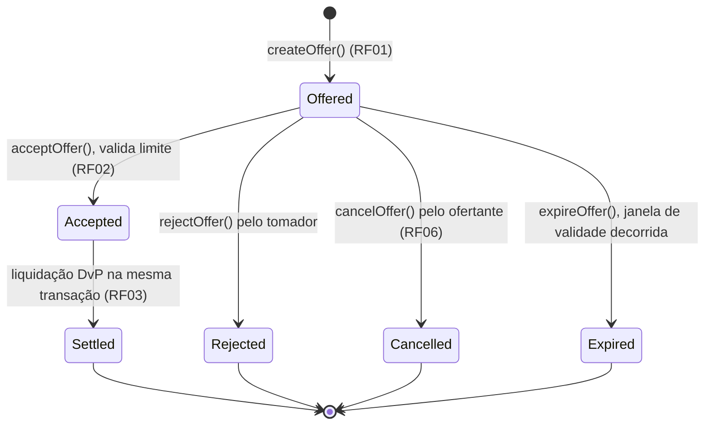

# Máquina de Estados — Oferta de Crédito Interfinanceiro (CDI)

> Implementação atual: escopo reduzido da Semana 3 · Web3
>
> Referência: TAP Banco Inter — RF01, RF02, RF03, RF06

## Estados

| Estado | Enum | Descrição |
| --- | --- | --- |
| **Ofertada** | `Offered` | Instituição criou uma oferta direcionada de crédito overnight. |
| **Aceita** | `Accepted` | Estado conceitual transitório durante `acceptOffer`; não fica persistido entre transações. |
| **Liquidada** | `Settled` | As duas pernas da liquidação DvP foram concluídas. Estado final. |
| **Cancelada** | `Cancelled` | Oferta cancelada pelo ofertante antes do vencimento. Estado final. |
| **Expirada** | `Expired` | Janela de validade (`expiresAt`) encerrada sem outra transição. Estado final. |
| **Rejeitada** | `Rejected` | Oferta recusada pelo tomador indicado. Estado final. |

No aceite, `OfferAccepted` e `OfferSettled` são emitidos na mesma transação. O
contrato persiste diretamente `Settled`, transfere o BRL tokenizado do credor
ao tomador e emite ao credor o NFT cujo `tokenId` é igual ao `offerId`. Se a
transferência ou a emissão falhar, a transação inteira reverte: a oferta
permanece `Offered`, o limite não é consumido e nenhum NFT é criado.

`expiresAt` é independente do `term` do empréstimo: `term` é o prazo do
crédito overnight concedido após o aceite, enquanto `expiresAt` é o prazo de
validade da própria oferta (definido por `validityWindow` em `createOffer`,
contado a partir de `createdAt`). Contratos não têm execução agendada, então
a transição `Offered → Expired` é observada de duas formas:
- **leitura (lazy)**: `getOfferStatus` retorna `Expired` assim que
  `block.timestamp >= expiresAt`, mesmo que ninguém tenha chamado
  `expireOffer` ainda; `getOffer` continua retornando o último status
  persistido.
- **persistência (explícita)**: qualquer conta pode chamar `expireOffer`
  após o vencimento para gravar `Expired` on-chain e emitir `OfferExpired`.

`acceptOffer`, `rejectOffer` e `cancelOffer` verificam a validade antes de agir.
Uma oferta vencida não pode seguir por nenhum desses caminhos, mesmo que
`expireOffer` ainda não tenha sido chamado.

## Diagrama

```mermaid
stateDiagram-v2
    [*] --> Offered: createOffer() (RF01)
    Offered --> Accepted: acceptOffer(), valida limite (RF02)
    Accepted --> Settled: liquidação DvP na mesma transação (RF03)
    Offered --> Rejected: rejectOffer() pelo tomador
    Offered --> Cancelled: cancelOffer() pelo ofertante (RF06)
    Offered --> Expired: expireOffer(), janela de validade decorrida
    Settled --> [*]
    Rejected --> [*]
    Cancelled --> [*]
    Expired --> [*]
```

## Gatilhos e guardas

| Transição | Função | Guarda | Efeito | Evento |
| --- | --- | --- | --- | --- |
| `[*] → Offered` | `createOffer` | credor e tomador cadastrados e distintos; valor, taxa, prazo e validade maiores que zero; limite suficiente | Cria oferta direcionada com `expiresAt` | `OfferCreated` |
| `Offered → Accepted` | `acceptOffer` | chamada pelo tomador; partes cadastradas; oferta válida e com limite | Emite o aceite transitório | `OfferAccepted` |
| `Accepted → Settled` | continuação de `acceptOffer` | allowance e saldo do credor; transferência e mint concluídos | Consome limite, transfere BRL tokenizado e emite NFT atomicamente | `OfferSettled` |
| `Offered → Rejected` | `rejectOffer` | tomador indicado, oferta ainda ofertada e não expirada | Persiste a rejeição | `OfferRejected` |
| `Offered → Cancelled` | `cancelOffer` | ofertante, oferta ainda ofertada e não expirou | Cancela | `OfferCancelled` |
| `Offered → Expired` | `expireOffer` | oferta existe, está ofertada e `block.timestamp >= expiresAt` | Persiste vencimento (chamável por qualquer conta) | `OfferExpired` |

## Papéis e unidades

- `DEFAULT_ADMIN_ROLE`: cadastra ou revoga instituições e define seus limites.
- `INSTITUTION_ROLE`: autoriza a carteira institucional a participar do fluxo.
- `MINTER_ROLE` do `BRLToken`: autoriza a emissão do BRL tokenizado simulado.
- `MINTER_ROLE` do `CDIPositionToken`: concedido ao contrato de ofertas no deploy.
- `amount` e limites: centavos de BRL tokenizado (duas casas decimais).
- `rateCDI`: pontos-base; `10_000` representa 100% do CDI.
- `term`: dias; `1` representa overnight.
- `validityWindow`, `createdAt`, `settledAt` e `expiresAt`: segundos Unix.

## Invariantes

- A oferta é direcionada a um único tomador cadastrado e não pode apontar para o próprio credor.
- Apenas o tomador indicado pode aceitar ou rejeitar; apenas o credor pode cancelar.
- Uma oferta só sai de `Offered` uma vez.
- `cancelOffer` é permitido somente em `Offered` e antes de `expiresAt`.
- Aceite, rejeição e cancelamento são bloqueados após `expiresAt`, mesmo sem persistir a expiração.
- O limite é conferido na criação e novamente no aceite; só é consumido quando a liquidação tem sucesso.
- Falha em qualquer perna DvP reverte estado, limite, transferência e emissão.
- `Settled`, `Rejected`, `Cancelled` e `Expired` são estados finais imutáveis.
- Uma carteira revogada não pode concluir uma oferta ainda aberta.
